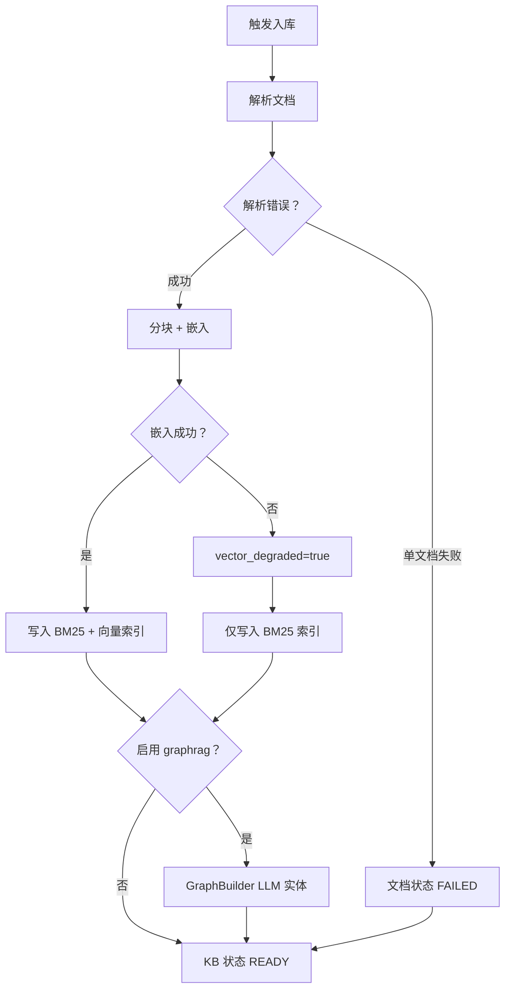

[English](02-internal-knowledge-base.md)

# 教程 2：构建内部知识库

将公司文档接入 **OpenCitadel**，实现 **私有、内网 Q&A** —— 数据不会离开你的部署环境。

## 概览

OpenCitadel 知识库支持：

- 文档上传（PDF、Markdown、纯文本）
- 分块 + 向量/混合检索
- 图增强搜索（`graph_search` 工具）
- 按用户/团队工作区隔离访问

## 入库流水线

添加文档后，`KBIngestionRunner` 执行以下流水线（SSE `step` 事件会反映每个阶段）：

- **Parse**：上传、ZIP、网页、Confluence 或飞书来源 → 每文档生成 `PageBlock`；`knowledge_base.ocr.mode=vision_llm` 时对图片型 PDF 做视觉 LLM OCR
- **Chunk**：通过 `KBChunker` 生成父/子块；通过 `KBVectorService` 嵌入
- **Index**：`replace_index_chunks()` 持久化可检索块
- **Graph**（可选）：`graphrag.enabled=true` 时运行 `GraphBuilder`（种子 `config.yaml` 中**默认启用**）
- **降级路径**：嵌入失败时设置 `vector_degraded=true`；检索回退到 BM25/混合模式，不使用向量

权威流水线说明见 [知识库摄取](../architecture/knowledge-base-ingestion.zh-CN.md)。

## 步骤

### 1. 创建知识库

1. 在 **顶栏工作区菜单** 中打开 **Knowledge**（非左侧边栏）
2. 点击 **New knowledge base**
3. 命名（如 `Engineering Handbook`）并选择可见性（个人或团队）

### 2. 入库文档

**上传文件：**

1. 打开知识库
2. 点击 **Add document** → 上传 PDF/MD/TXT（默认单文档最大 **50 MB** — 见 AppConfig `knowledge_base.document.max_bytes`；网关上限 200 MB）
3. 等待索引完成（文档列表中显示状态）

**可选连接器**（在 `.env` 中配置）：

- Confluence（`CONFLUENCE_TOKEN`）
- 飞书/Lark（`FEISHU_APP_ID`、`FEISHU_APP_SECRET`）

### 3. 提问（Doc QA 流程）

新建会话并提问：

> Search our engineering handbook: what is our incident response process for P1 outages?

Agent 会使用 `kb_search` 和 `get_document` 工具检索已索引内容。

### 4. 结合通用 Agent 任务

示例：

> Based on our security policy document in the Engineering Handbook KB, draft a checklist for onboarding new contractors.

Agent 会检索政策摘录，然后在沙箱中撰写清单。

## 最佳实践

| 实践 | 原因 |
|------|------|
| 按主题拆分大型 PDF | 提高检索精度 |
| 使用团队工作区 | 带 RBAC 的共享知识库 |
| 在 `config.yaml` 中启用 vector memory | 更好的长会话记忆 |
| 阅读 [安全模型](../architecture/security-model.zh-CN.md) | 理解数据边界 |

## 评估建议

从文档中创建 10–20 组问答对，在向更大团队推广前先抽查检索质量。

## 下一步

- [知识库摄取](../architecture/knowledge-base-ingestion.zh-CN.md)
- [教程 3：MCP 集成](./03-mcp-integrations.zh-CN.md)
- [安全模型](../architecture/security-model.zh-CN.md)
