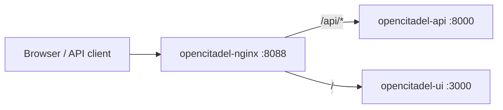

# Nginx Gateway

[简体中文](README.zh-CN.md)

OpenCitadel's edge gateway terminates HTTP/HTTPS on port **8088** (HTTP) or **443** (HTTPS when enabled), reverse-proxying to the API and UI containers.

## Role in the stack



| Path | Upstream | Notes |
|------|----------|-------|
| `/api/*` | `opencitadel-api:8000` | SSE chat, WebSocket VNC, REST |
| `/` | `opencitadel-ui:3000` | Next.js App Router |

## Configuration files

| File | Purpose |
|------|---------|
| [nginx.conf](nginx.conf) | Global gzip, `client_max_body_size`, WebSocket map |
| [templates/default.http.conf.template](templates/default.http.conf.template) | HTTP server block |
| [templates/default.https.conf.template](templates/default.https.conf.template) | HTTPS server block (TLS certs) |
| [generate-config.sh](generate-config.sh) | Renders templates from `.env` (`OPENCITADEL_DOMAIN`, `HTTPS_ENABLED`) |

Compose mounts generated config into the `opencitadel-nginx` service. See [Production deployment](../docs/operations/deployment.md) and [HTTPS setup](../docs/operations/https-domain-setup.md).

## Upload size limit

```nginx
client_max_body_size 200m;
```

This is the **gateway ceiling** for all POST bodies. Per-feature limits may be lower:

| Feature | Effective limit | Enforced by |
|---------|-----------------|-------------|
| Codebase ZIP | 200 MB | UI `CODEBASE_ZIP_MAX_BYTES` + nginx |
| Knowledge base document | 50 MB default | AppConfig `knowledge_base.document.max_bytes` |
| Marketplace upload | 25 MB default | AppConfig `server.marketplace_max_upload_bytes` |

Keep UI constants, nginx, and AppConfig aligned when changing codebase upload limits.

## SSE and WebSocket

The `/api/` location disables buffering and sets long timeouts for streaming:

- `proxy_buffering off`, `X-Accel-Buffering no`, `gzip off`
- `proxy_read_timeout` / `proxy_send_timeout`: 86400s
- WebSocket upgrade via `$connection_upgrade` map in `nginx.conf`

Required for `/api/sessions/{id}/chat` SSE and `/api/sessions/{id}/vnc` WebSocket.

## Dynamic upstream DNS

Templates use Docker embedded DNS (`resolver 127.0.0.11`) with variables for upstream hostnames so container IP changes after recreate do not cause 502 errors:

```nginx
set $api_upstream opencitadel-api;
proxy_pass http://$api_upstream:8000$request_uri;
```

## Related documentation

- [Architecture overview](../docs/architecture/overview.md)
- [Production deployment](../docs/operations/deployment.md)
- [HTTPS & domain setup](../docs/operations/https-domain-setup.md)
- [Knowledge base ingestion](../docs/architecture/knowledge-base-ingestion.md) — document size limits
