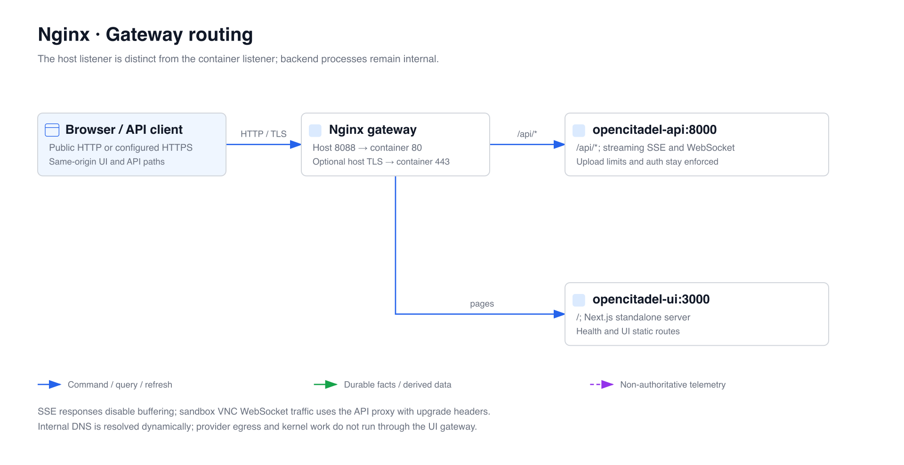

# Nginx Gateway

[简体中文](README.zh-CN.md)

OpenCitadel's edge gateway terminates HTTP/HTTPS on port **8088** (HTTP) or **443** (HTTPS when enabled), reverse-proxying to the API and UI containers.

## Role in the stack



| Path     | Upstream               | Notes                         |
| -------- | ---------------------- | ----------------------------- |
| `/api/*` | `opencitadel-api:8000` | SSE chat, WebSocket VNC, REST |
| `/`      | `opencitadel-ui:3000`  | Next.js App Router            |

## Configuration files

| File                                                                           | Purpose                                                               |
| ------------------------------------------------------------------------------ | --------------------------------------------------------------------- |
| [nginx.conf](nginx.conf)                                                       | Global gzip, `client_max_body_size`, WebSocket map                    |
| [templates/default.http.conf.template](templates/default.http.conf.template)   | HTTP server block                                                     |
| [templates/default.https.conf.template](templates/default.https.conf.template) | HTTPS server block (TLS certs)                                        |
| [generate-config.sh](generate-config.sh)                                       | Renders templates from `.env` (`OPENCITADEL_DOMAIN`, `HTTPS_ENABLED`) |

Compose mounts generated config into the `opencitadel-nginx` service. See [Production deployment](../docs/operations/deployment.md) and [HTTPS setup](../docs/operations/https-domain-setup.md).

Compose maps host `NGINX_PORT=8088` to container port 80 and `NGINX_HTTPS_PORT=443` to container port 443. The HTTP template listens only on 80; the HTTPS template redirects on 80 and terminates TLS on 443. The entrypoint renders `/etc/nginx/templates-src` to the named-volume `/etc/nginx/conf.d/default.conf`; an empty domain becomes `_` for HTTP and fails startup for HTTPS. HTTPS requires `LETSENCRYPT_DIR` and existing certificates. Both templates set CSP, nosniff, and Referrer-Policy; only HTTPS sets HSTS.

## Upload size limit

```nginx
client_max_body_size 100m;
```

This is the **gateway ceiling** for all POST bodies. Per-feature limits may be lower:

| Feature                 | Effective limit | Enforced by                                          |
| ----------------------- | --------------- | ---------------------------------------------------- |
| Knowledge base document | 50 MB default   | Execution Policy `knowledge_base.document.max_bytes` |

Keep nginx and the typed Execution Policy aligned when changing upload limits.

## SSE and WebSocket

The `/api/` location disables buffering and sets long timeouts for streaming:

- `proxy_buffering off`, upstream request header `X-Accel-Buffering: no`, `gzip off`
- `proxy_read_timeout` / `proxy_send_timeout`: 86400s
- WebSocket upgrade via `$connection_upgrade` map in `nginx.conf`

Required for `/api/sessions/{id}/chat` SSE and `/api/sessions/{id}/vnc` WebSocket.

## Dynamic upstream DNS

Templates use Docker embedded DNS (`resolver 127.0.0.11`) with variables for upstream hostnames so container IP changes after recreate do not cause 502 errors:

```nginx
set $api_upstream opencitadel-api;
proxy_pass http://$api_upstream:8000$request_uri;
```

## Related documentation

- [Architecture overview](../docs/architecture/overview.md)
- [Production deployment](../docs/operations/deployment.md)
- [HTTPS & domain setup](../docs/operations/https-domain-setup.md)
- [Knowledge base ingestion](../docs/architecture/knowledge-base-ingestion.md) — document size limits
