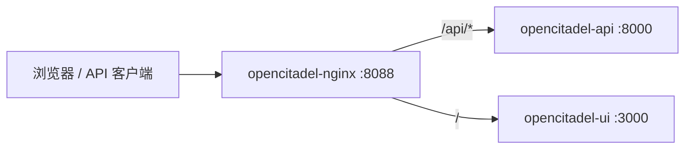

# Nginx 网关

[English](README.md)

OpenCitadel 边缘网关对外暴露 **8088**（HTTP）或 **443**（启用 HTTPS 时），反向代理至 API 与 UI 容器。

## 在栈中的位置



| 路径 | 上游 | 说明 |
|------|------|------|
| `/api/*` | `opencitadel-api:8000` | SSE 聊天、WebSocket VNC、REST |
| `/` | `opencitadel-ui:3000` | Next.js App Router |

## 配置文件

| 文件 | 用途 |
|------|------|
| [nginx.conf](nginx.conf) | 全局 gzip、`client_max_body_size`、WebSocket 映射 |
| [templates/default.http.conf.template](templates/default.http.conf.template) | HTTP server 块 |
| [templates/default.https.conf.template](templates/default.https.conf.template) | HTTPS server 块（TLS 证书） |
| [generate-config.sh](generate-config.sh) | 从 `.env` 渲染模板（`OPENCITADEL_DOMAIN`、`HTTPS_ENABLED`） |

Compose 将生成后的配置挂载到 `opencitadel-nginx` 服务。详见[生产部署](../docs/operations/deployment.zh-CN.md)与 [HTTPS 配置](../docs/operations/https-domain-setup.zh-CN.md)。

## 上传大小限制

```nginx
client_max_body_size 200m;
```

这是所有 POST 请求的**网关上限**。各功能可能有更低限制：

| 功能 | 有效限制 | 执行方 |
|------|----------|--------------|
| Codebase ZIP | 200 MB | UI `CODEBASE_ZIP_MAX_BYTES` + nginx |
| 知识库文档 | 默认 50 MB | AppConfig `knowledge_base.document.max_bytes` |
| 市场上传 | 默认 25 MB | AppConfig `server.marketplace_max_upload_bytes` |

修改 Codebase 上传上限时需同步 UI 常量、nginx 与 AppConfig。

## SSE 与 WebSocket

`/api/` location 关闭缓冲并设置长超时以支持流式传输：

- `proxy_buffering off`、`X-Accel-Buffering no`、`gzip off`
- `proxy_read_timeout` / `proxy_send_timeout`：86400s
- 通过 `nginx.conf` 中 `$connection_upgrade` 映射支持 WebSocket 升级

用于 `/api/sessions/{id}/chat` SSE 与 `/api/sessions/{id}/vnc` WebSocket。

## 动态上游 DNS

模板使用 Docker 内置 DNS（`resolver 127.0.0.11`）与变量上游主机名，避免容器重建后 IP 变化导致 502：

```nginx
set $api_upstream opencitadel-api;
proxy_pass http://$api_upstream:8000$request_uri;
```

## 相关文档

- [系统架构](../docs/architecture/overview.zh-CN.md)
- [生产部署](../docs/operations/deployment.zh-CN.md)
- [HTTPS 与域名](../docs/operations/https-domain-setup.zh-CN.md)
- [知识库摄取](../docs/architecture/knowledge-base-ingestion.zh-CN.md) — 文档大小限制
