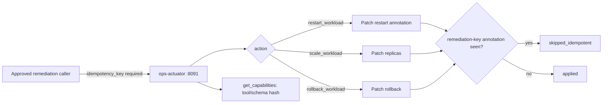

[简体中文](README.zh-CN.md)

# OpenCitadel Ops Actuator

The Ops Actuator is a separately deployable, write-capable MCP service for Ops Patrol remediation. It is the write-side sibling of the read-only [Ops Collector](../ops-collector/README.md) and shares its structure and security posture. It exposes exactly **three registered write actions** — restart, scale, and rollback — against namespace- and workload-allowlisted Kubernetes Deployments/StatefulSets. There is no arbitrary `kubectl`, no free-form command execution, and no access to Secrets, `exec`, or `attach`.

## Operations

| Tool | Kind support | Mutates | Bounded input |
|------|---------------|---------|----------------|
| `get_capabilities` | — | No | Returns tool/schema/capability hashes |
| `restart_workload` | Deployment, StatefulSet | Yes | Allowlisted namespace + registered workload id; requires `idempotency_key` |
| `scale_workload` | Deployment, StatefulSet | Yes | Allowlisted namespace + registered workload id; `replicas` must be within the registered `min_replicas`/`max_replicas`; requires `idempotency_key` |
| `rollback_workload` | Deployment only | Yes | Allowlisted namespace + registered workload id; requires `idempotency_key` |

`get_capabilities` is annotated read-only. All three write tools are annotated `readOnlyHint=false, destructiveHint=true` — an MCP client must not treat them as safe, repeatable reads.

Every write call **requires** `idempotency_key`. The Actuator patches that key into the target's `opencitadel.io/remediation-key` annotation in the same patch that performs the action. A repeated call with the same key is answered from the current observed state (`action_outcome=skipped_idempotent`) without a second mutating Kubernetes call; a different key executes again. Write actions are **never retried** on transient failure — a failed call returns `K8S_ERROR` (or a more specific code) immediately. Retry is a decision for the caller's approval chain, not this service.

Each response uses the `ActuatorEnvelope`: `target_ref`, `action`, `action_outcome` (`applied` / `skipped_idempotent` / `failed`), `before`/`after` observation snapshots, bounded `data`, evidence references (`actuator://evidence/...`), warnings, and a stable error code.

## Request flow



Only the backend execution service — never the model — calls one of the three write actions, and only after a human approves the specific call; see [Governance plane](../docs/architecture/governance-plane.md) for the approval and idempotency-key contract shared by every governed write, and [Ops Patrol architecture](../docs/architecture/ops-patrol.md#safety-invariants) for this service's own safety invariants.

## Configuration reference

Configuration is environment-only and uses the `OPS_ACTUATOR_` prefix. Structured values are JSON.

| Variable | Default / range | Purpose |
|----------|------------------|---------|
| `TARGET_REF` | `opencitadel-local` | Stable identity matched by the Pack |
| `ALLOWED_NAMESPACES` | `["opencitadel"]` | Non-empty namespace allowlist |
| `ALLOWED_WORKLOADS` | `{}` | JSON map of namespace to workload id to `{kind, min_replicas, max_replicas}`; a workload not listed here cannot be targeted by any write action |
| `TRANSPORT` | `streamable-http` | `streamable-http` or development-only `stdio` |
| `ALLOW_STDIO` | `false` | Must also be true before stdio can start |
| `HOST` / `PORT` | `0.0.0.0` / `8091` | Listener for streamable HTTP (`/mcp`) |
| `CONCURRENCY` | `4`, range 1–8 | Maximum simultaneous write actions |
| `MAX_OUTPUT_BYTES` | `65536`, max 1 MiB | Serialized response cap |
| `MAX_ROWS` | `200`, max 1000 | Tabular/sample cap |
| `MAX_ARRAY_ITEMS` | `200`, max 1000 | Per-array cap |
| `MAX_STRING_CHARS` | `32768`, max 131072 | Per-string cap |

The complete variable name is the prefix plus the table name, for example `OPS_ACTUATOR_ALLOWED_WORKLOADS`.

Example Helm values use native YAML objects and render them to JSON:

```yaml
opsActuator:
  enabled: true
  targetRef: production-cluster-a
  allowedNamespaces: [opencitadel]
  allowedWorkloads:
    opencitadel:
      opencitadel-api:
        kind: deployment
        min_replicas: 2
        max_replicas: 10
      opencitadel-worker:
        kind: deployment
        min_replicas: 1
        max_replicas: 6
```

Only workloads listed under `allowedWorkloads` can ever be restarted, scaled, or rolled back; every other request is denied (`NAMESPACE_DENIED` / `TARGET_DENIED`) before any Kubernetes call is made.

## Run locally

Streamable HTTP (`/mcp`, port `8091`) is the default:

```bash
docker compose --profile patrol up -d --build opencitadel-ops-actuator
```

For development-only stdio:

```bash
OPS_ACTUATOR_ALLOW_STDIO=true uv run opencitadel-ops-actuator --transport stdio
```

Never enable stdio in the production deployment.

## Kubernetes deployment

- Helm: set `opsActuator.enabled=true` and configure `allowedNamespaces`/`allowedWorkloads` in `deploy/helm/opencitadel/values.yaml`.
- Kustomize: use `deploy/kustomize/ops-actuator` as a base and patch its image, target ref, and allowlists.
- Keep the Service `ClusterIP`; only the approval/remediation caller should reach port 8091.
- The ServiceAccount's RBAC must only ever grant `get`, `list`, `watch`, and `patch` on Deployments, StatefulSets, and ReplicaSets — never `create`, `delete`, Secrets, `pods/exec`, or `pods/attach`. There is no `kubectl exec` path anywhere in this service.
- Review NetworkPolicy egress against the exact Kubernetes API location. The registered-workload allowlist is the application-layer boundary; NetworkPolicy is defense in depth.

The container runs as UID/GID 10001 with a read-only root filesystem, all Linux capabilities dropped, `RuntimeDefault` seccomp, and only a bounded writable `/tmp` — the same posture as the Ops Collector.

## Authentication and data handling

Kubernetes access uses the Pod ServiceAccount; that credential never becomes a tool argument or response field. The Actuator redacts authorization-shaped values, passwords, API keys, tokens, connection strings, cookies, JWT-shaped values, and secret-shaped object fields from `data`/`before`/`after` before output limiting. Do not rely on redaction as the only control: keep the allowlist minimal and never expose the Actuator publicly.

## Development and verification

```bash
uv sync --frozen
uv run pytest -q
```

`tests/test_rbac_baseline.py` statically scans the actuator's RBAC manifest(s) once they exist (produced by a later task in this remediation plan); until then its cases are skipped.

## Related documentation

- [Ops Patrol architecture](../docs/architecture/ops-patrol.md)
- [Ops Patrol operations](../docs/operations/ops-patrol.md)
- [Run a Patrol](../docs/tutorials/06-ops-patrol.md)
- [Ops Collector](../ops-collector/README.md) — the read-only sibling service
