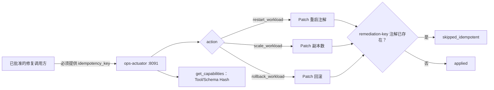

[English](README.md)

# OpenCitadel Ops Actuator

Ops Actuator 是为 Ops Patrol 补救场景独立部署、具备写能力的 MCP 服务，是只读姊妹服务 [Ops Collector](../ops-collector/README.zh-CN.md) 的写操作版本，结构与安全姿态与其保持一致。它仅暴露**三个注册制写动作**——restart、scale、rollback，作用范围限定在 Namespace 与 Workload 均白名单化的 Kubernetes Deployment/StatefulSet 上。不存在任意 `kubectl`、不接受自由格式命令执行，也不访问 Secret、`exec`、`attach`。

## 操作

| Tool | 支持的 Kind | 是否变更集群 | 有界输入 |
|------|-------------|--------------|----------|
| `get_capabilities` | — | 否 | 返回 Tool/Schema/Capability Hash |
| `restart_workload` | Deployment、StatefulSet | 是 | 白名单 Namespace + 已注册 Workload ID；必须提供 `idempotency_key` |
| `scale_workload` | Deployment、StatefulSet | 是 | 白名单 Namespace + 已注册 Workload ID；`replicas` 必须落在注册的 `min_replicas`/`max_replicas` 之内；必须提供 `idempotency_key` |
| `rollback_workload` | 仅 Deployment | 是 | 白名单 Namespace + 已注册 Workload ID；必须提供 `idempotency_key` |

`get_capabilities` 声明为只读。三个写工具均声明 `readOnlyHint=false, destructiveHint=true`——MCP 客户端不得将其当作安全、可重复的读操作。

每次写调用都**强制要求** `idempotency_key`。Actuator 会在执行动作的同一次 Patch 中，把该 Key 写入目标对象的 `opencitadel.io/remediation-key` 注解。使用相同 Key 的重复调用会直接基于当前观测状态返回（`action_outcome=skipped_idempotent`），不会触发第二次变更性 Kubernetes 调用；使用不同 Key 则会重新执行。写动作在瞬时失败时**绝不重试**——失败直接返回 `K8S_ERROR`（或更具体的错误码）。重试与否是调用方审批链路的决策，不属于本服务职责。

响应统一使用 `ActuatorEnvelope`：`target_ref`、`action`、`action_outcome`（`applied` / `skipped_idempotent` / `failed`）、`before`/`after` 观测快照、有界 `data`、证据引用（`actuator://evidence/...`）、警告与稳定错误码。

## 请求流程



只有后端执行服务——绝非模型本身——会调用三个写动作之一，且必须在人工批准该具体调用之后；每次受治理写操作共享的审批与幂等键契约见 [治理平面](../docs/architecture/governance-plane.zh-CN.md)，本服务自身的安全不变量见 [Ops Patrol 架构](../docs/architecture/ops-patrol.zh-CN.md#safety-invariants)。

## 配置参考

配置仅来自环境变量，统一使用 `OPS_ACTUATOR_` 前缀；结构化值使用 JSON。

| 变量 | 默认值 / 范围 | 作用 |
|------|---------------|------|
| `TARGET_REF` | `opencitadel-local` | 与 Pack 匹配的稳定目标身份 |
| `ALLOWED_NAMESPACES` | `["opencitadel"]` | 非空 Namespace 白名单 |
| `ALLOWED_WORKLOADS` | `{}` | Namespace 到 Workload ID 到 `{kind, min_replicas, max_replicas}` 的 JSON Map；未在此登记的 Workload 无法被任何写动作作为目标 |
| `TRANSPORT` | `streamable-http` | `streamable-http` 或仅开发使用的 `stdio` |
| `ALLOW_STDIO` | `false` | 启动 stdio 前还必须显式设为 true |
| `HOST` / `PORT` | `0.0.0.0` / `8091` | Streamable HTTP 监听地址（`/mcp`） |
| `CONCURRENCY` | `4`，范围 1–8 | 最大并发写动作数 |
| `MAX_OUTPUT_BYTES` | `65536`，最大 1 MiB | 序列化响应上限 |
| `MAX_ROWS` | `200`，最大 1000 | 表格/采样行上限 |
| `MAX_ARRAY_ITEMS` | `200`，最大 1000 | 单个数组元素上限 |
| `MAX_STRING_CHARS` | `32768`，最大 131072 | 单个字符串上限 |

完整变量名为前缀加表中名称，例如 `OPS_ACTUATOR_ALLOWED_WORKLOADS`。

Helm Values 使用原生 YAML 对象，并在模板中渲染为 JSON：

```yaml
opsActuator:
  enabled: true
  targetRef: production-cluster-a
  allowedNamespaces: [opencitadel]
  allowedWorkloads:
    opencitadel:
      opencitadel-api:
        kind: deployment
        min_replicas: 2
        max_replicas: 10
      opencitadel-worker:
        kind: deployment
        min_replicas: 1
        max_replicas: 6
```

只有在 `allowedWorkloads` 中登记的 Workload 才能被 restart、scale 或 rollback；其余任何请求都会在触达 Kubernetes 之前被拒绝（`NAMESPACE_DENIED` / `TARGET_DENIED`）。

## 本地运行

默认使用 Streamable HTTP（`/mcp`，端口 `8091`）：

```bash
docker compose --profile patrol up -d --build opencitadel-ops-actuator
```

仅开发使用的 stdio：

```bash
OPS_ACTUATOR_ALLOW_STDIO=true uv run opencitadel-ops-actuator --transport stdio
```

生产部署严禁启用 stdio。

## Kubernetes 部署

- Helm：设置 `opsActuator.enabled=true`，并在 `deploy/helm/opencitadel/values.yaml` 中配置 `allowedNamespaces`/`allowedWorkloads`。
- Kustomize：以 `deploy/kustomize/ops-actuator` 为 Base，Patch 镜像、Target Ref 与白名单。
- Service 保持 `ClusterIP`，仅允许审批/补救调用方访问 8091。
- ServiceAccount 的 RBAC 只能对 Deployment、StatefulSet、ReplicaSet 授予 `get`、`list`、`watch`、`patch`——绝不包含 `create`、`delete`、Secret、`pods/exec`、`pods/attach`。本服务不存在任何 `kubectl exec` 路径。
- 根据 Kubernetes API 的准确位置复核 NetworkPolicy Egress。已注册 Workload 白名单是应用层边界，NetworkPolicy 作为纵深防御。

容器使用 UID/GID 10001、只读根文件系统、删除全部 Linux Capability、`RuntimeDefault` seccomp，并仅提供有界可写 `/tmp`——与 Ops Collector 保持一致的姿态。

## 认证与数据处理

Kubernetes 访问使用 Pod ServiceAccount，该凭据不会成为 Tool 参数或响应字段。Actuator 会在应用输出上限前，对 `data`/`before`/`after` 中的 Authorization 形态值、密码、API Key、Token、连接串、Cookie、JWT 形态文本和 Secret 形态对象字段进行脱敏。不能只依赖脱敏：应保持白名单最小化，Actuator 绝不能暴露到公网。

## 开发与验证

```bash
uv sync --frozen
uv run pytest -q
```

`tests/test_rbac_baseline.py` 会在 Actuator RBAC 清单文件（由本补救计划的后续任务产出）存在后对其做静态扫描；产出前相应用例会被跳过。

## 相关文档

- [Ops Patrol 架构](../docs/architecture/ops-patrol.zh-CN.md)
- [Ops Patrol 运维](../docs/operations/ops-patrol.zh-CN.md)
- [运行 Patrol](../docs/tutorials/06-ops-patrol.zh-CN.md)
- [Ops Collector](../ops-collector/README.zh-CN.md) —— 只读姊妹服务
