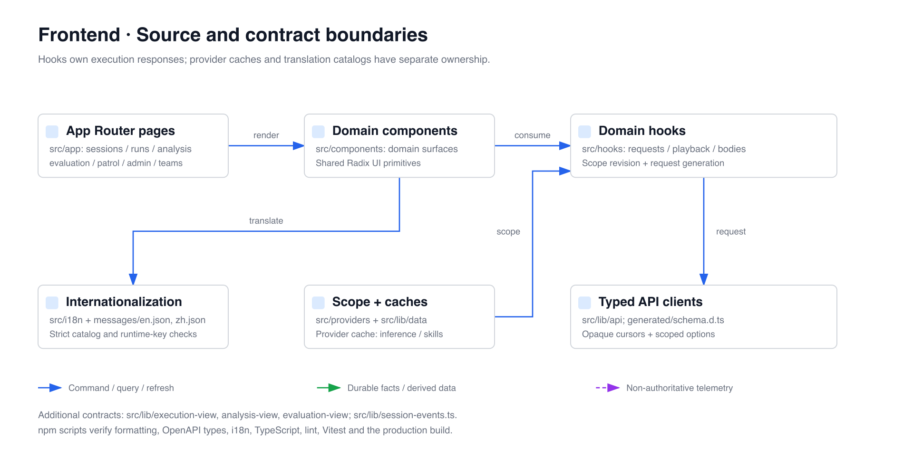

# OpenCitadel UI

[简体中文](README.zh-CN.md)

Next.js 16 / React 19 frontend for event-sourced Agent sessions, immutable
knowledge versions, automation, patrol, execution workbenches, analysis/comparisons/exports, evaluation, governance, and platform
administration.

## Contract boundary

The UI is a projection client. It submits API commands and renders formal
Run, Activity, approval, resource-build, and public-event views. It never
infers workflow completion from connection state or local timers.

- Session live delivery and replay use the same public execution-event model.
- Durable cursors are opaque to components.
- Approval actions target persisted approval batches; chat text is not an
  approval protocol.
- Internal Activity payloads, provider secrets, and event hashes are not part
  of the browser contract.
- Resource sessions pin an immutable published version.

## Source map



Important routes include `/sessions/[id]`, `/knowledge`, `/automation`,
`/patrols`, `/patrol-runs/[id]`, `/teams`, and `/admin/*`.
Settings contains General, Agent, Inference, Skills, Memory, Integrations, and an
administrator-only Runtime section.

## Execution and evaluation surfaces

- `/runs/[id]`: Live/Playback workbench and bounded bodies; historical views cannot dispatch current actions.
- `/analysis`, `/analysis/comparisons/[id]`: captured analysis, comparison revisions, diff jobs and exports.
- `/evaluations`: dataset, configuration, rubric, suite, recording, environment, batch and review pages.
- The provider caches `inference`/`skills` resources and supplies scope; execution, analysis and body responses belong to their domain hooks. Identity/workspace changes invalidate prior generations, preventing late cross-scope responses.
- SSE triggers formal view refresh. Feed cursors, page cursors and historical `at` are not interchangeable. Generated OpenAPI types live in `src/lib/api/generated/schema.d.ts`; `npm run api:check` verifies synchronization.

## Development

```bash
npm ci
npm run format:check
npm run api:check
npm run i18n:check
npm run typecheck
npm run lint
npm run test
npm run build
```

`messages/en.json` and `messages/zh.json` are the only translation sources.
Update both catalogs directly; `npm run i18n:check` rejects mismatched,
missing, unused, unregistered dynamic, or hardcoded user-facing text.

Use `src/lib/api/fetch.ts` for API access, preserve strict TypeScript, keep
domain components in their domain directory, and avoid hard-coded API routes
outside `src/lib/api/`.

The development server runs on `http://localhost:3000`. The browser API base
is `/api` by default. Next.js rewrites proxy it to `NEXT_PUBLIC_API_PROXY_TARGET`
(default `http://localhost:8088`). `NEXT_PUBLIC_API_BASE_URL` explicitly overrides
the browser base URL. Nginx handles production traffic through the same `/api` path.

See [frontend architecture](../docs/architecture/frontend-ui.md) and
[execution kernel](../docs/architecture/execution-kernel.md).

[Execution analysis](../docs/architecture/execution-analysis.md) · [Evaluation control plane](../docs/architecture/evaluation-control-plane.md)
